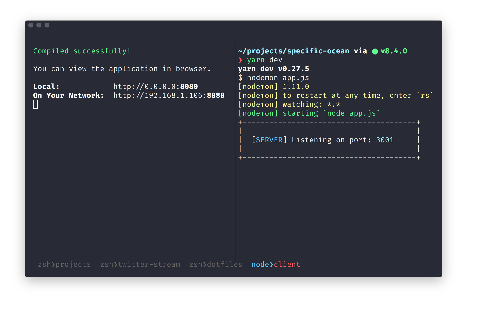

# dotfiles

> Running [**iTerm2**](https://www.iterm2.com/) with [**oh-my-zsh**](https://github.com/robbyrussell/oh-my-zsh) and [**Spaceship-zsh-theme**](https://github.com/denysdovhan/spaceship-zsh-theme). 

Another alternative is [**Hyper**](https://github.com/zeit/hyper), it can run the same config and looks basically the same.

The color scheme is [**iTerm2 - Snazzy**](https://github.com/sindresorhus/iterm2-snazzy) for _iTerm2_ and the font is [**Fira Code**](https://github.com/tonsky/FiraCode)



_The bottom row is from `tmux`. The pane shows which process is running and which folder you are currently in_

## Files

* `.aliases` - All my own aliases, all git-aliases is supplied by [`oh-my-zsh/wiki/git`](https://github.com/robbyrussell/oh-my-zsh/wiki/Plugin:git)
* `.functions` - bash-functions, called by aliases
* `.tmux.conf` - configuration for [`tmux`](https://github.com/tmux/tmux/wiki)
* `.vimrc` - My [`vim`](https://en.wikipedia.org/wiki/Vim_(text_editor)) configuration.
* `.zshenv` - All environment variables exported here.
* `.zshrc` - Most of the `zsh`-config, sourcing `.aliases` and `.functions`

## Installation

If you are on _Windows 10_ I recommend installing [bash on Windows/WSL](https://msdn.microsoft.com/en-us/commandline/wsl/about) and using `bash` through either [Hyper](https://github.com/zeit/hyper) or [cmder](http://cmder.net/). Through `bash` you can install `zsh` and run this config.

1 . Download and install latest beta from [**download@iTerm2**](https://www.iterm2.com/downloads.html) (Only for macOS)

2 . Install `zsh` according to these instructions: [**installing zsh**](https://github.com/robbyrussell/oh-my-zsh/wiki/Installing-ZSH)

3 . Install [`oh-my-zsh`](https://github.com/robbyrussell/oh-my-zsh), copy paste one of these commands:

_curl_:
```bash
sh -c "$(curl -fsSL https://raw.githubusercontent.com/robbyrussell/oh-my-zsh/master/tools/install.sh)"
```

_wget_
```bash
sh -c "$(wget https://raw.githubusercontent.com/robbyrussell/oh-my-zsh/master/tools/install.sh -O -)"

```

4 . Download the _iTerm2_ Color Scheme files from this repository and save anywhere on your computer: [**iterm2-snazzy**](https://github.com/sindresorhus/iterm2-snazzy)

5 . In **iTerm2**, go to `Preferences > Profiles` and create a new profile by pressing `+` in bottom left corner or edit the default profile.

6 . Select your profile and go to the `Colors`-tab, in the bottom right there is a dropdown with the text _Color Presets..._. Click it and then choose `Import`. Find your downloaded color scheme and import it, then select it afterwards in the dropdown.

7 . Install the `spaceship-zsh-theme` with npm and follow instructions in the terminal. If you get instructions or warnings/errors follow them to properly install: 

```bash
npm install -g spaceship-zsh-theme
```

8 . Reload the `.zshrc` by running. Everytime you make a change in `.zshrc` you have to _source_ the file so it reloads. This can be done with either `.` or `source`:

```bash
. ~/.zshrc
```

10 . I also have two extra plugins installed: [`zsh-syntax-highlighting`](https://github.com/zsh-users/zsh-syntax-highlighting) and [`zsh-autosuggestions`](https://github.com/zsh-users/zsh-autosuggestions). You can either install them or remove the lines from `.zshrc` that includes them.

## Extra 

##### Merge title bar

To merge the title bar with the background, just change the `Tab Color` to the same as the background color:


##### Padding

I have added padding to all sides which you can do under `Advanced` in settings. Just search for `margin` and change `Height of top and botton margins in terminal spaces` and `Width of left and right margins in terminal spaces`


